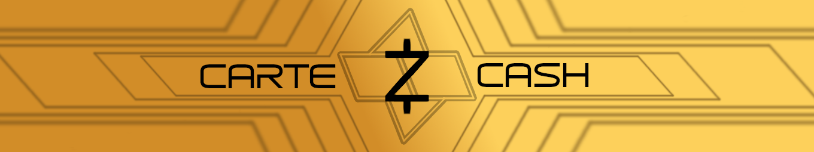
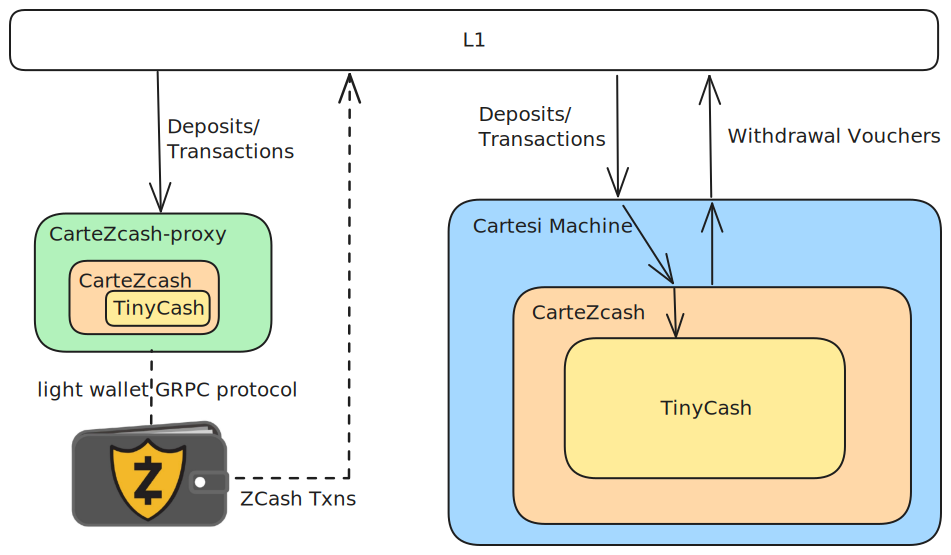

# CarteZcash

CarteZcash takes Zcash and turns it into a Cartesi RollApp. Created for the 2024 Cartesi Hackathon.

## Motivation

The Zcash shielded pool is one of the most trusted private cryptocurrency protocols that has stood the test of time. Actually obtaining and using Zcash however is a poor user experience that generally requires the use of a centralized exchange. 

What if you could shield your Eth assets directly from Ethereum by depositing them into a Zcash L2? That is what CarteZcash allows you to do!

## How It Works (Detailed Description)

### Architecture



CarteZcash takes parts of the [Zebra](https://github.com/ZcashFoundation/zebra) Zcash client and uses them to build a mini version of the protocol called we call [TinyCash](./tiny-cash/). This is similar to how Optimism uses [minigeth](https://github.com/ethereum-optimism/minigeth) for the Ethereum state transition.

TinyCash is Zcash but with the following changes:

- All network upgrades up to NU5 are applied in the first block
- Each block contains only a single coinbase transaction and up to one user transaction
- No checking of proof-of-work
- No miner rewards
- Transaction fees not enforced

TinyCash then runs inside the Cartesi machine to produce a fully functional rollup.

All interactions with the L2 are done via the Cartesi contracts. Deposits, transactions and withdrawals are all supported.

### Deposits

Using Portals it is possible to deposit Eth into the rollup and have it minted as CarteZcash Coins into a transparent Zcash address.

This works by using the coinbase transaction functionality that was previously used for issuing mining rewards. Upon receiving an `AdvanceState` message that matches an Eth deposit action, CarteZcash instructs TinyCash to mine a new block with a coinbase that mints coins to the wallet address decoded from the `execLayerData` field. These new minted coins are transparent (not shielded) but can be made anonymous by making another transaction into the shielded pool.

### Transfers

CarteZcash is able to process regular Zcash transactions produced and signed by any Zcash wallet. This includes private shielded transactions! 

The prepared transactions just need to be serialized and then sent to CarteZcash via the InputBox contract.

### Withdrawals

To withdraw from the CarteZcash L2 and get your coins back on L1 you simply cast your coins into the fires of Mt Doom!

What this means is you make a transparent transaction sending your coins to the Mt Doom address `t1Hsc1LR8yKnbbe3twRp88p6vFfC5t7DLbs`. This address has no private key so the coins can never be spent again.

CarteZcash watches for transaction to this address and when it observes one will issue a voucher to release the corresponding number of coins on L1.

### Wallet Interface

CarteZcash integrates with existing Zcash wallets via the [cartezcash-proxy](./cartezcash-proxy/) component. The proxy exposes a GRPC interface that matches the [lightwalletd](https://zcash.readthedocs.io/en/latest/rtd_pages/lightclient_support.html) specification. This allows any complaint wallet to read the blockchain state and request the require info to update the wallet balances.

The proxy is essentially an indexer that runs the same program as the Cartesi machine but with additional data storage and interfaces. Having the proxy allows the program running in the Cartesi machine to aggressively prune old block data which is no longer needed for verification but wallets might need for updating their balance. It also avoids having to use the `inspect` HTTP API to retrieve state and allows for using GRPC instead.

## Repo Structure

The following components were developed as part of the hackathon and should be considered for judging

### [cartezcash crate](./src/)

This contains the top level logic of querying the host for `AdvanceState`/`InspectState` responses and translating these into requests for a `tiny-cash` service.

It also deals with reponding to detected coin burns and issuing withdrawal vouchers.

This can run in two modes depending on the Cargo features configured during build. With the default features it runs in the mode to be executed within the Cartesi machine. With features `listen-graphql,lightwalletd` it runs as a CarteZcash fullnode which stores the full chain state in order to serve wallets.

### [tiny-cash crate](./tiny-cash/)

This crate exports a tower service through which requests can be made to make state transitions in the blockchain. It exposes a simple interface defined by the `Request` enum:

```rust
pub enum Request {
    /// Add the genesis block to the state
    Genesis,
    /// Form a coinbase transaction that mints the given amount and produce a new block that includes it
    Mint {
        amount: Amount<NonNegative>,
        to: transparent::Script,
    },
    /// Produce a new block that includes the given transaction
    IncludeTransaction { transaction: Transaction },
}
```

This service itself is created from two Zebra tower services - a state service and a transaction verifier service. The []`TinyCashWriteService::call()`](https://github.com/willemolding/CarteZcash/blob/4804db1af4f395b818d675244b53f94e02e4edf5/tiny-cash/src/write.rs#L94) function is where the majority of the logic is contained.

## Challenges Faced

### Building for the Cartesi Machine

One of the main early challenges in the project was getting the Zebra client to compile for RiscV. Doing so required patching two upstream crates (ring and rocksDB). These diffs for these fixes can be found at 

- https://github.com/briansmith/ring/compare/main...willemolding:ring:willemolding/riscv-build-0.16.20
- https://github.com/rust-rocksdb/rust-rocksdb/compare/master...willemolding:rust-rocksdb:willemolding/riscv-support

With these patches in place and some minor modifications to the docker image for cross-compilation it was possible to build the full Zebra Zcash client for the cartesi machine.

### Modifications to Zcash

The goal was to make as few modifications to the exiting Zcash client as possible. The required changes can be seen 

- https://github.com/ZcashFoundation/zebra/compare/main...willemolding:zebra:willem/tinycash

Unfortunately it was a little more than I hoped for mainly because a lot of Zcash network parameters were hard-coded. For example Zebra can only be configured for either Mainnet or Testnet and within these known networks there are pre-determined height for upgrades and known historical checkpoint blocks.

The main changes made were to apply all Zcash historical chain upgrades in the first block and to disable any consensus related checks (e.g. proof-of-work, fork selection). All round only a few hundred line changes were needed (mostly deletions).

### Wallet Integration

One of the early goals for the project was to be able to integrate with the existing Zcash ecosystem wallets and tools. This also proved a bit tricky due to hard-coded network parameters. Getting a wallet to work requires some minor changes around checkpointing to remove hard-coded historical blocks. The wallet also had to be configured to include spends to pay the miner fees as they are not required for CarteZcash.

Integrating with the [Zingo](https://github.com/zingolabs/zingolib) CLI wallet proved pretty straightforward and othere wallets can be modified in the future.

## Future Work

In its current form CarteZcash requires all transactions to be submitted via the InputBox contract on L1. This could be gas expensive as every shielded Zcash transaction includes a large ZK proof. A more efficient design would introduce a sequencer that either:that takes these proofs and submits them in a batch. An even more efficient design would aggregate all the proofs in a batch together into a single proof and only submit that on L1. As the Zcash orchard shielded pool uses Halo2 this kind of aggregation is definitely possible!

Another approach might be to use blobs or a separate DA service to store the transaction data.

### Outstanding Issues

The fullnode currently has a few issues making some wallets behave strangely.
- It doesn't simulate the mempool properly so wallets don't get notified when transactions are accepted and need to rescan
- It fails on batch queries in some cases so wallet sync is slow

## Hackathon Reflection

I anticipated that cramming the full Zcash client into the Cartesi machine was going to be the hardest part of this project but it turned out to be very simple. Aside from the initial build issues the client was able to run in the VM, including features such as caching the RocksDB to the filesystem, without any modifications.

In particular I was skeptical if it would be able to verify the Halo2 ZK proofs required for shielded transactions. Not only did this work but it was only perhaps 50% slower than running the verifier natively! Once I made this discovery I was pretty confident at being able to get everything to work.

The tooling from Sunodo was an absolutely pleasure to use and meant I was able to spend much less time setting up the build/test environment and spend a lot more time developing the core of the application in Rust.

This same process could likely be applied to any blockchain state transition as a strategy to turn it into a rollup with maximum code reuse.

---

# Demo Instructions

## Pre-requisites

- The project uses [just](https://github.com/casey/just) as a command runner. Please install that first
- Building requires stable Rust and Cargo (tested version 1.76.0)
- Running the demo requires Cartsi CLI. See the [installation instructions](https://docs.sunodo.io/guide/introduction/installing)
    - This requires Docker be installed and the Docker host up and running

## Building

Build with:

```shell
just build # or cartesi build
```

This cross-compiles for risvc using docker.

## Running the Demo

### Setup 

#### Option 1 - Local Mode

This runs CarteZcash locally rather than inside the Cartesi machine. This is a bit faster and easier to debug.

Start the Sunodo services (Anvil, cartesi node, subsquid, etc) with:

```shell
just run-nobackend # or cartesi run --no-backend
```

in another shell run the dApp in local mode

```shell
just run-local
```

This command runs the program in fullnode mode so there is no need to run another process.

#### Option 2 - Cartesi Machine Mode

If you want to see it running in the Cartesi machine for real then build and run with

```shell
cartesi build
cartesi run
```

We also need to run a fullnode process. The full node is required to cache blockchain state and serve data to wallets.

#### Fullnode

The fullnode is needed to serve the wallets. It connects to a cartesi machine running the cartezcash dApp and processes the transactions, and maintains a chain state the wallets can query. There can be any number of full nodes for a single CarteZcash dApp.

In another shell start the fullnode with service with:

```shell
just run-fullnode
```

This is set up to work correctly with the default cartesi configuration of addresses and ports

> [!INFO]
> You can also run a full node connected to the live Cartezcash testnet by running `just run-fullnode-testnet`

#### Terminal 2 - Wallet

Install and start a Zingo CLI wallet based off the Cartezcash fork with:

```shell
just install-wallet
just start-wallet
```

optionally also start another wallet to sent funds to

```shell
just start-wallet-2
```

> If you restart the chain you need to clear the wallet data and sync chain because the wallet expects the chain history to be immutable. This can be done with `just clear-wallet`.

### Steps

#### Deposit into L2

First lets deposit some 1 Eth from the L1 anvil testnet into the L2. To do this get the hex encoded transparent address of the wallet by running

```shell
>> addresses
```
in zingo-wallet which should respond with something like:

```
(mainnet) Block:0 (type 'help') >> addresses
[
  {
    "address": "...",
    "receivers": {
      "transparent": "t1gFWLbUvSo27sp6XBHAEb9YpVLMcgNADDU", <------- THIS ONE
      "sapling": "...",
      "orchard_exists": true
    }
  }
]
```

Then run

```shell
just deposit 0xf5772fe264e896c51d37a41648778b5155134b15 1
```

and select the wallet and account to transfer from.

From the wallet CLI run:

```shell
>> rescan
>> balance
``` 
 
You should see the transparent balance update!

> Funds are displayed in zatoshis so if you transferred 1 Eth you will see 100000000 zatoshis in the wallet. This amount is still redeemable for 1 Eth.

#### Shield funds

Now to shield these funds so they are private. From the Zingo Wallet CLI run

```shell
>> shield
>> confirm
```

This will build a transaction and send it to the full-node which will submit it to the InputBox contract to be processed by the rollApp.

Want a minute or so for the Cartesi node to verify the ZK proofs then run `rescan` and `balance` in the wallet to see the funds moved to the Orchard shielded pool.

#### Send Shielded Funds

Now our funds are shielded we can transfer them privately. Lets send some to another wallet. From a new shell run

```shell
just start-wallet-2
```
and get the wallet address same as before. Lets send to its private address this time. It should be `u1q7myvyvetdvl26jde38h0qg39crx3kz3nnfuryvkz579gql6375s78076z7mqs9yypdr2wu3j4xfltqswqenk66f0jamg3g0wr8330xdw778twy5kmgkz0y2u8sh9qpumynrwkkuarfxqpjf3nvkm07vdlxxtm376fm2tyyl7jm9wfgmtupmvh4yjslcdqaz90c6v5g0txf9v55m36a`

From the original wallet run the following:
```
>> send u1q7myvyvetdvl26jde38h0qg39crx3kz3nnfuryvkz579gql6375s78076z7mqs9yypdr2wu3j4xfltqswqenk66f0jamg3g0wr8330xdw778twy5kmgkz0y2u8sh9qpumynrwkkuarfxqpjf3nvkm07vdlxxtm376fm2tyyl7jm9wfgmtupmvh4yjslcdqaz90c6v5g0txf9v55m36a 50000000
>> confirm
```

After waiting for the transactions to verify you should be able to rescan both wallets and see the balances updated!

#### Withdraw to L1

You can now withdraw funds from either wallet by sending to the Mt Doom address (`u1k7ant55p6u5lgwhf9ss4qurcz35pjeav398lw0e0xmqqdm0aksvhrpa2gtnmv83lggean4pm8n7tgtr9ssnrpevkyrgw9y5e4ck23j6g`). We will withdraw from Wallet 2

```
>> send u1k7ant55p6u5lgwhf9ss4qurcz35pjeav398lw0e0xmqqdm0aksvhrpa2gtnmv83lggean4pm8n7tgtr9ssnrpevkyrgw9y5e4ck23j6g 50000000 <eth-address>
>> confirm
```

You should see CarteZcash detect the burn and issue a withdrawal voucher.

The voucher can then be executed from the CartesiDApp contract. 

## Acknowledgements

Big thanks to:
- [Sunodo](https://sunodo.io/) for their top class tooling
- [Mugen Builders](https://github.com/Mugen-Builders) for the wallet template I used in the demo
- [Zebra](https://github.com/ZcashFoundation/zebra) team for their easy to follow codebase
- [Zingo Labs](https://github.com/zingolabs) for developing Zingo wallet
- [Ayad](https://github.com/ayad318) for improving the web wallet design
- [lychee](https://twitter.com/LycheeLyrica) for the logo and banner
